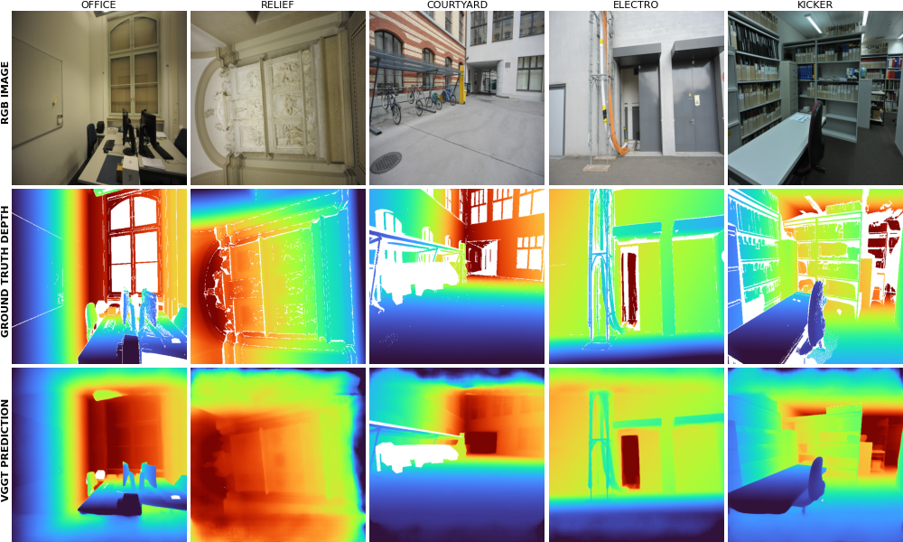
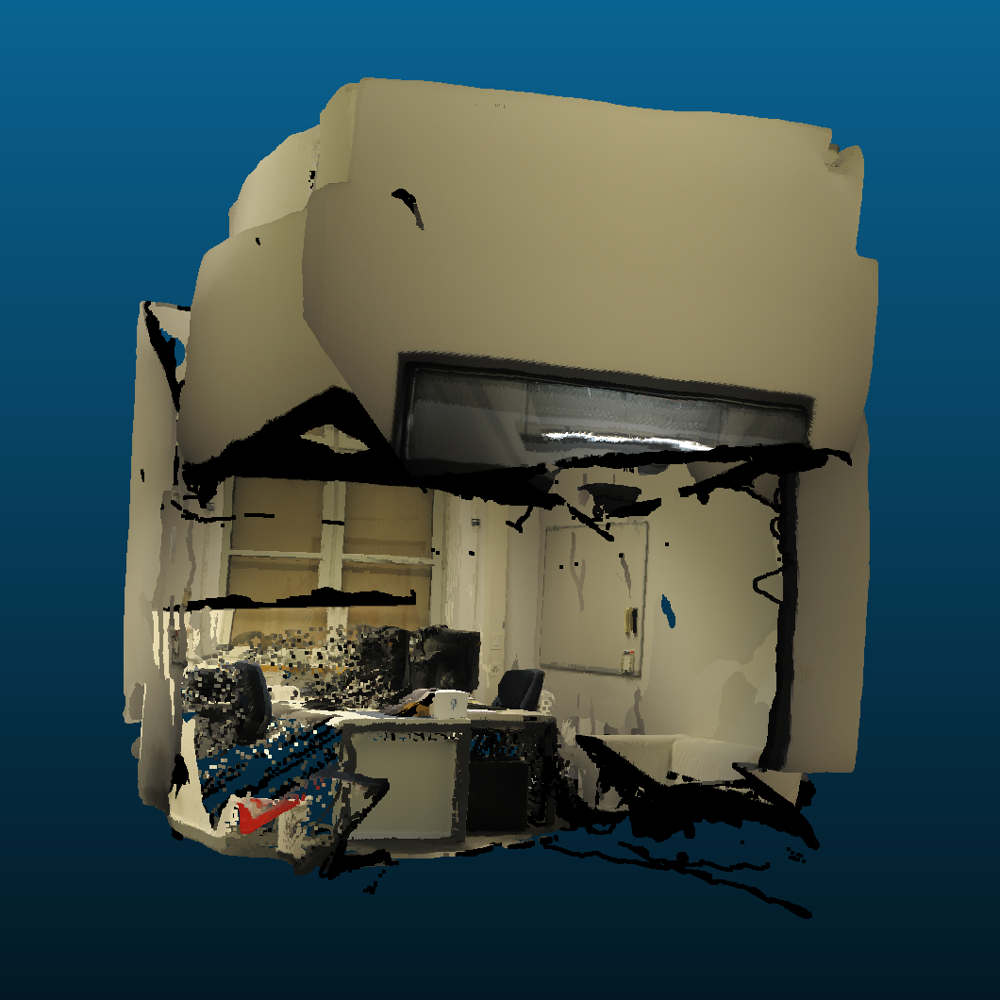
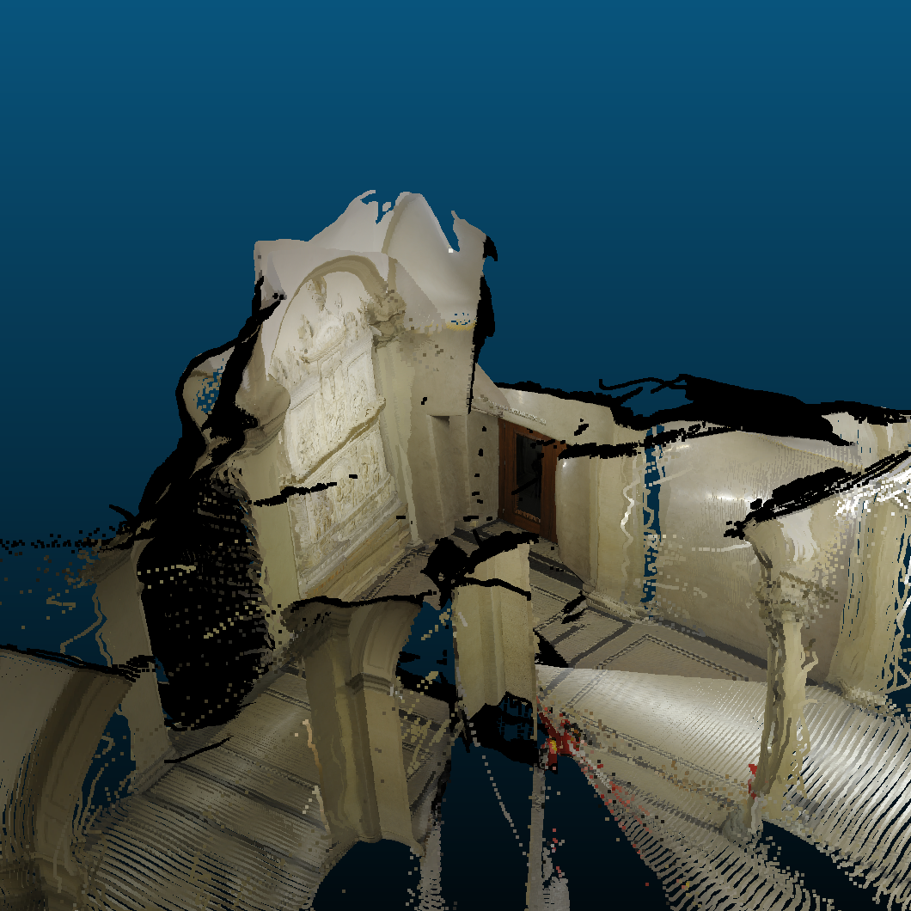
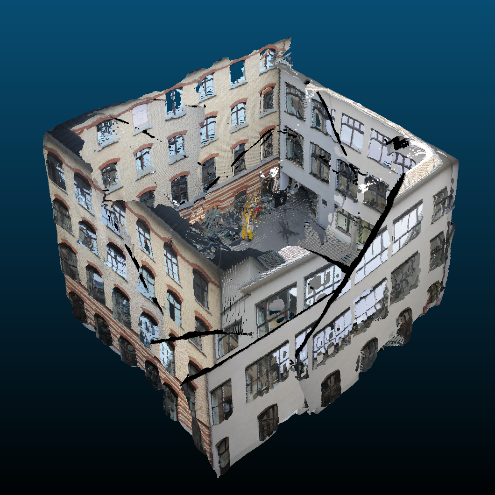

# VGGT – ETH3D Benchmark

This repository contains a reproduction and analysis of the paper:

[**VGGT: Visually Grounded Geometry Transformers for 3D Scene Understanding**](https://vgg-t.github.io/)

The project was carried out as part of the **NPM3D course** and focuses on understanding the VGGT architecture and reproducing its evaluation pipeline on the **ETH3D dataset**.

---

# Project Structure

```
vggt-3d-reconstruction/
├── data/                       # ETH3D dataset (not included)
├── docs/
│   └── paper.pdf               # VGGT's paper
│   └── report.pdf              # Project report
├── models/                     # VGGT pretrained weights
├── outputs/                    # Generated reconstructions and results
├── scripts/                    # Helper scripts and utilities
│   ├── distortion.py
│   ├── init_env.py
│   ├── utils.py
│   └── vggt_ops.py
├── vggt/                       # VGGT model implementation
├── run_inference.py            # Run VGGT inference on ETH3D scenes
├── run_benchmark.py            # Alignment + evaluation metrics
├── run_memory_test.py          # Runtime and GPU memory scaling experiment
├── requirements.txt
├── pyproject.toml
└── README.md
```

---

# Installation

Create a Python environment (Python ≥ 3.10 recommended).

Install dependencies:

```bash
pip install -r requirements.txt
```

---

# Environment Initialization

This project includes a helper script to automatically download all required assets. Running the following command will:

```bash
python scripts/init_env.py
```

- download the **VGGT pretrained model (≈5GB)** from HuggingFace
- download the **ETH3D dataset (≈20GB)** from [HuggingFace](https://huggingface.co/datasets/Uniiii/eth3d_v2)
- place all files in the correct directories (`models/` and `data/`)


The script performs the following setup:

```
models/
└── model.pt

data/
└── eth3D/
    ├── courtyard/
    ├── office/
    ├── relief/
    ├── electro/
    └── kicker/
```

The full download size is approximately **25GB** and typically takes **3–5 minutes on Google Colab**. This step only needs to be executed **once** before running the experiments.

# Running Inference

To generate depth maps and point clouds with VGGT, use the following command. You can adjust the sampling and threshold parameters directly from the CLI:

```bash
python run_inference.py --n_frames 5 --conf_threshold 1.0 --dataset_path "data/eth3D/" --outputs_path "outputs/eth3D_local/"
```

This script:

- loads the pretrained VGGT model
- samples input images from each scene
- predicts depth maps and camera poses
- reconstructs point clouds
- saves outputs in `outputs/`

---

# Running Benchmark

To evaluate the predictions against the ground truth:

```bash
python run_benchmark.py --conf_threshold 1.0 --dataset_path "data/eth3D/" --preds_path "outputs/eth3D_local/"
```

This script performs:

- Umeyama alignment between predicted and ground truth point clouds
- computation of ETH3D metrics:
  - **Accuracy**
  - **Completion**
  - **Overall score**

---

# Runtime and Memory Analysis

To evaluate how VGGT scales with the number of input images:

```bash
python run_memory_test.py --scene_name "courtyard" --dataset_path "data/eth3D/"
```

This script measures:
- inference runtime
- GPU memory consumption
as a function of the number of input frames.

---

# Results

The reproduction experiments were conducted on a subset of the ETH3D dataset including the following scenes:

- Office
- Relief
- Courtyard
- Electro
- Kicker

Results include both:

- **quantitative evaluation**
- **qualitative 3D reconstructions**

Example reconstructions:

<p align="center">
  
  <br>
  <em>Input image – Ground truth depth – Depth predicted by VGGT</em>
</p>

<div align="center">





<br>
<em>Reconstructed point maps for Office, Relief and Courtyard scenes.</em>

</div>

---

# Report

The full analysis and discussion of the results can be found in:

```
docs/paper.pdf
```

---

# References

VGGT paper:

```
@article{wang2025vggt,
  title={Visually Grounded Geometry Transformers},
  author={Wang, Jianyuan et al.},
  journal={arXiv preprint},
  year={2025}
}
```

FastVGGT:

```
@article{shen2025fastvggt,
  title={FastVGGT: Training-Free Acceleration of Visual Geometry Transformer},
  author={Shen, You and Zhang, Zhipeng and Qu, Yansong and Cao, Liujuan},
  journal={arXiv preprint},
  year={2025}
}
```